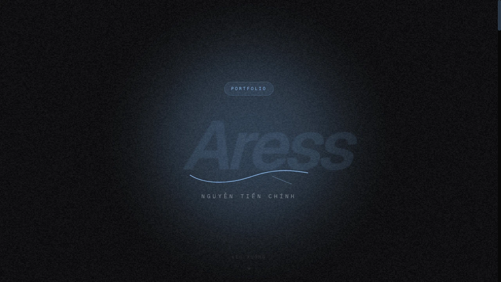

# Nguyen Tien Chinh — Interactive Developer Portfolio 🚀

<p align="left">
  <a href="https://tienchinh.me"></a>
  
  
  
</p>



A modern, cyberpunk-inspired **[interactive developer portfolio](https://tienchinh.me)** built with **Next.js 15 (Turbopack)**, **React 19**, **Tailwind CSS v4**, **Prisma ORM**, and **WebGL**.

---

## ✨ Key Highlights & Features

- **⚡ Modern Fullstack Stack:** Built with Next.js 15 App Router and React 19 server/client components.
- **🖥️ Interactive Terminal CLI:** Fully functional in-browser terminal simulator (`help`, `whoami`, `skills`, `projects`, `sudo hire`, `clear`).
- **🌐 Full Bilingual Support (i18n):** Instant client-side English / Vietnamese dictionary switching.
- **🎮 Playful Interactive Elements:** WebGL particle background (OGL), custom audio sound FX (`use-sound`), retro Playdate console, and interactive Snake game.
- **🔐 Auth & Data Layer:** Better Auth integration with Prisma ORM for community guestbook and interactive tasks.

---

## 💻 Tech Stack

**Framework & Frontend**
- [Next.js 15](https://nextjs.org/) — App Router with Turbopack
- [React 19](https://react.dev/) — Modern UI library
- [TypeScript 5](https://www.typescriptlang.org/) — Strict type safety
- [Tailwind CSS v4](https://tailwindcss.com/) — Utility-first styling
- [Framer Motion (`motion`)](https://motion.dev/) — Fluid animations
- [Lucide Icons](https://lucide.dev/) — Icon system
- [OGL](https://github.com/oframe/ogl) — Minimal WebGL library for particle effects

**Backend & Data**
- [Prisma ORM 6](https://www.prisma.io/) — Type-safe database client
- [Better Auth](https://better-auth.dev/) — Authentication & session management
- [Zod](https://zod.dev/) — Runtime schema validation

**State & Utilities**
- [Zustand](https://github.com/pmndrs/zustand) — Global client state
- [TanStack React Query](https://tanstack.com/query) — Server state caching
- [Canvas Confetti](https://github.com/catdad/canvas-confetti) — Visual celebrations
- [Day.js](https://day.js.org/) & [Lodash](https://lodash.com/)

---

## 🏁 Run Locally

### 1. Clone the repository
```bash
git clone https://github.com/tienchinh21/portfolio.git
cd portfolio
```

### 2. Install dependencies
```bash
npm install
```

### 3. Configure Environment Variables
Create a `.env` file based on `.env.example`:
```bash
cp .env.example .env
```

### 4. Generate Prisma Client
```bash
npx prisma generate
```

### 5. Start Development Server
```bash
npm run dev
```

Open [http://localhost:3000](http://localhost:3000) in your browser to explore the portfolio!
